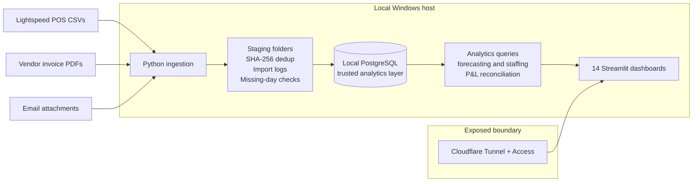
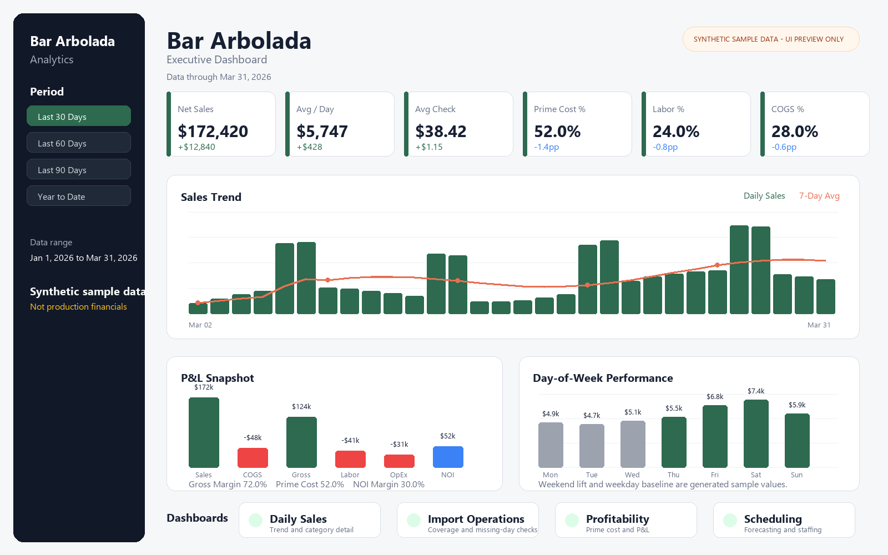

# Bar Arbolada Analytics System

A local-first data warehouse and analytics system for a real bar/restaurant. It unifies POS sales, labor, inventory, vendor invoices, and expenses into one PostgreSQL layer with automated daily ingestion, data-quality checks, and 14 Streamlit dashboards, deployed so only the dashboard is exposed.

This was built privately as a working local system for Bar Arbolada in Oklahoma City. The public repository is a sanitized portfolio snapshot, so the commit history starts late; the useful review surface is the schema, ingestion pipeline, dashboards, tests, and deployment runbooks.

## Public Data Note

Production data is intentionally not included. Raw POS exports, vendor invoices, QuickBooks exports, generated reports, logs, local database contents, `.env`, email credentials, Cloudflare credentials, and other business-specific artifacts are excluded by `.gitignore`.

That means a fresh clone shows how the system is structured and how it runs, but it will not reproduce the real business dashboards unless you provide your own compatible data or a synthetic sample dataset.

## Architecture



PostgreSQL, raw imports, invoice parsing, email ingestion, and scheduled jobs stay local. Cloudflare Tunnel + Access publishes only the Streamlit dashboard and restricts access by allowlisted email.

## Design Decisions

**Local-first with PostgreSQL.** I kept the database and ingestion local because this system works with real financial and staff data. Cloudflare Tunnel + Access exposes only the dashboard, while PostgreSQL, raw imports, and automation stay on the local host.

**Ingestion reliability over cleverness.** Daily reports arrive as ordinary CSV/PDF/email artifacts, and they do not always arrive cleanly. The pipeline is built around staging folders, import logs, SHA-256 duplicate detection, and missing-day checks so it is clear what landed, what was skipped, and what still needs attention.

**One queryable operating layer.** The schema brings POS sales, labor, invoices, inventory, recipes, operating expenses, payroll settings, and scheduling into one place. Dashboards and reports can then query a shared layer instead of each rebuilding its own version of the business.

**Reconciliation as a trust mechanism.** The QuickBooks P&L comparison exists so the internal numbers can be checked against an external accounting source. For this project, trust matters more than a polished chart that nobody can verify.

**Inventory ledger as on-hand source of truth.** Theoretical stock and reorder signals come from `inv_daily_ledger`, not `inv_items.current_qty`. See [`docs/adr/0001-inventory-ledger-source-of-truth.md`](docs/adr/0001-inventory-ledger-source-of-truth.md).

## Dashboard Preview

The preview below uses synthetic sample values only. It is included to show the dashboard UI and workflow shape without exposing production sales, labor, vendor, invoice, payroll, or expense data.



## Quick Start

### Prerequisites

- Python 3.11+.
- PostgreSQL 16+.
- A local `.env` copied from `.env.example`.

### Setup

```bash
# Clone / navigate to project
cd bar-arbolada-database

# Create virtual environment
python -m venv .venv

# Windows
.venv\Scripts\activate

# macOS / Linux
# source .venv/bin/activate

# Install runtime dependencies
pip install -r requirements.txt

# Configure database connection
copy .env.example .env
# Edit .env with your local PostgreSQL credentials

# Create database and tables
python scripts/setup_db.py
```

On macOS/Linux, use `cp .env.example .env` instead of `copy`.

### Import Data

Real business exports are not included in this public repository. To use the importers with your own compatible data:

```bash
# Import all CSV files from the configured raw CSV folder
python scripts/import_all.py
```

Daily email ingestion can pull report attachments from an IMAP inbox:

```bash
python scripts/import_from_email.py --source imap
```

Manual fallback uses a local folder as the source:

```bash
python scripts/import_from_email.py --source local --local-source-dir raw-csvs-before-pos-changes
```

Configuration keys for email ingestion are documented in `.env.example`.

### Run Dashboards

```bash
streamlit run dashboards/app.py
```

Windows helper:

```powershell
powershell -ExecutionPolicy Bypass -File scripts/start_dashboard.ps1
```

All dashboard pages live under `dashboards/pages/` and appear in the Streamlit sidebar:

1. Daily Sales
2. Staffing & Rush
3. Comps & Leakage
4. Invoices
5. Inventory Items
6. Recipes
7. Inventory
8. Profitability
9. Product Mix
10. Operating Expenses
11. Payroll
12. Import Operations
13. COGS Deep Dive
14. Scheduling

## Tests

Install dev dependencies, then run:

```bash
pip install -r requirements-dev.txt
python -m pytest -q
```

Current tests cover import-status snapshot serialization and trusted-labor query scoping. Useful next tests would cover attachment deduplication, report type detection, and missing-day coverage checks.

## Project Layout

```text
src/
  config.py              Database connection and project paths
  models.py              SQLAlchemy schema for the analytics warehouse
  importers/             Lightspeed CSV parsers and invoice PDF parsing
  email_sources/         IMAP and local-folder ingestion adapters
  operations/            Import status snapshot helpers
  analytics/             Shared query layer, forecasting, and staffing logic

dashboards/
  app.py                 Streamlit entry point
  Home.py                Executive dashboard homepage
  pages/                 14 dashboard pages

scripts/
  setup_db.py            Local PostgreSQL setup and Alembic migration runner
  import_all.py          CSV import orchestration
  import_from_email.py   Email attachment ingestion with staging/status output
  compare_bookkeeper_pl.py  QuickBooks P&L reconciliation
  start_dashboard.ps1    Local-only Streamlit startup helper
  run_email_import.ps1   Task Scheduler-friendly import wrapper

alembic/                 Database migrations
planning-documents/      Local deployment and ingestion runbooks
ops/cloudflared/         Example Cloudflare Tunnel config
tests/                   Focused pytest coverage
```

## Local Multi-User Access

The deployment runbook is in `planning-documents/cloudflare-local-dashboard-runbook.md`.

The operating model is:

- Keep PostgreSQL local.
- Keep the IMAP importer local.
- Run Streamlit on `127.0.0.1`.
- Publish only the dashboard through Cloudflare Tunnel.
- Restrict access with Cloudflare Access email allowlisting.

## P&L Reconciliation

`scripts/compare_bookkeeper_pl.py` compares a QuickBooks-style P&L export against the same period in the local analytics database. The goal is not to replace accounting; it is to surface material differences between operational data and the accounting source of truth.

```bash
python scripts/compare_bookkeeper_pl.py raw-pl-reports/pl_jan_2026.csv
```

QuickBooks exports belong in `raw-pl-reports/`, which is gitignored.
